# Aula 5 (07/08/2020) - Finalizando app mobile

## Conectando Mobile

Precisamos instalar novamente a biblioteca que facilita o consumo de API externas pela aplicação:
yarn add axios

<h1 align="center">
    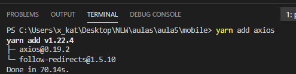
    <br>
</h1>

Como no projeto Web, crie uma pasta services e dentro dela o arquivo api.ts.

<h1 align="center">
    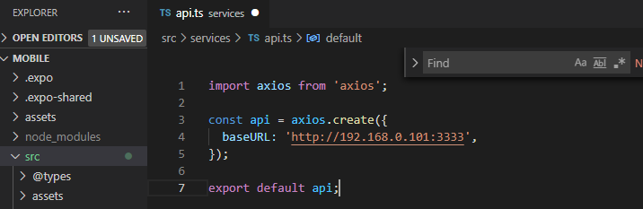
    <br>
</h1>


O IP que utilizamos é o disponibilizado pelo Metro Bundler abaixo que permite testarmos a aplicação. Lembre-se que sempre que trocar de máquina, deve-se atualizar este número para testar na máquina atual.
```bash
192.168.0.101:3333
```
<h1 align="center">
    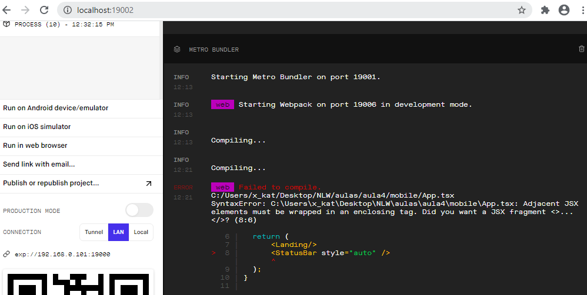
    <br>
</h1>


Isso é necessário pois o localhost pode não ser acessível na rede, então é necessário utilizar o IP. Em um terminal paralelo, navegue até a pasta do servidor e inicie-o com o comando yarn start. Depois teste com o Insomnia a conexão:
 <h1 align="center">
    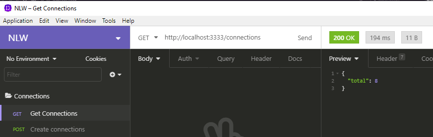
    <br>
</h1>

A chamada da API na aplicação mobile é idêntica a da web.
 <h1 align="center">
    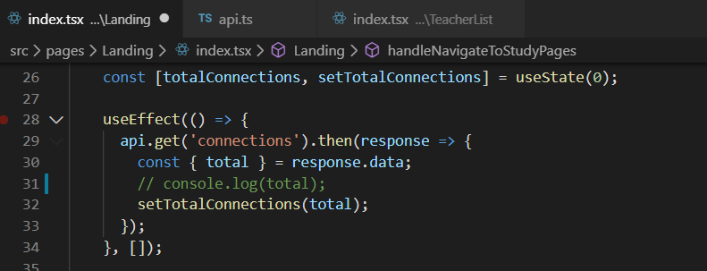
    <br>
</h1>
 <h1 align="center">
    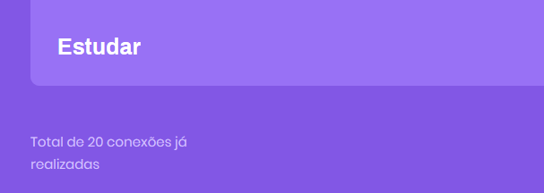
    <br>
</h1>

Já nos componentes de filtro da página TeacherList, uma diferença é que invés de Onchange está se usando OnchangeText, mas isso porque, por razões de tempo, não foi implementado a caixa de seleção (ficando como um dos Desafios mais adiante).
 <h1 align="center">
    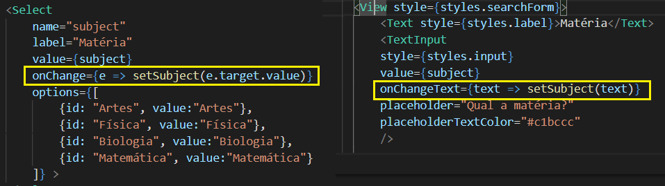
    <br>
</h1>


Para testar o botão de filtro é possível fazer a mesma estratégia de emitir um console.log no método relacionado:
 <h1 align="center">
    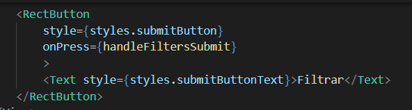
    <br>
</h1>
 <h1 align="center">
    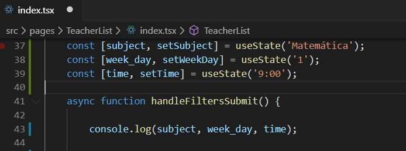
    <br>
</h1>


Única coisa a se lembrar é de trocar o aparelho que estiver se testando, se for emulador ou aparelho físico.
 <h1 align="center">
    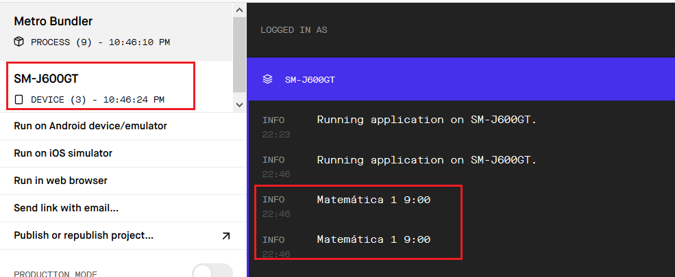
    <br>
</h1>
 

Feito isso o método é idêntico ao do projeto web:
 <h1 align="center">
    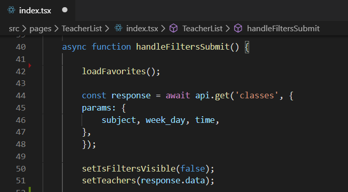
    <br>
</h1> 

 <h1 align="center">
    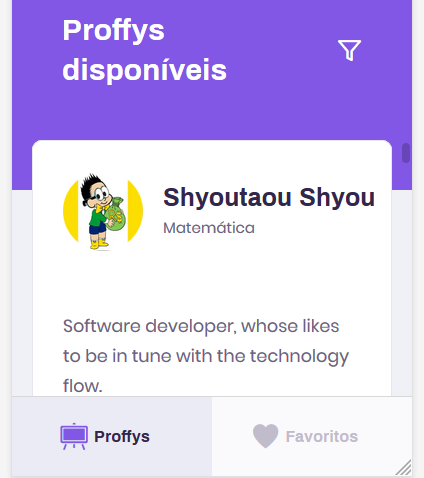
    <br>
</h1> 

## WhatsApp – Deep Linking

No botão do WhatsApp vamos aplicar uma técnica conhecida como “Deep Linking” onde uma aplicação abre outra aplicação. Grande parte de aplicação mobile tem um endereço URL em que é possível acessar pelo módulo do React Native Linking:

```bash
import { View, Image, Text, Linking, AsyncStorage } from 'react-native'; 
```
 <h1 align="center">
    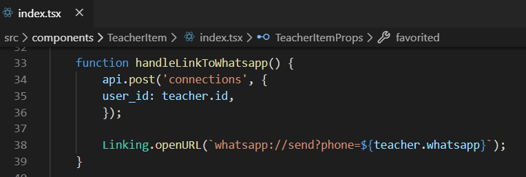
    <br>
</h1> 

## Favoritos – Armazenamento Interno

Para armazenamento interno no mobile precisamos instalar um DB pelo:
```bash
expo install @react-native-community/async-storage
```
 <h1 align="center">
    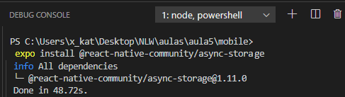
    <br>
</h1> 

Temos que criar a propriedade no componente TeacherItem para sabermos quando foi favoritado e fazer as mudanças necessárias no Layout.

 <h1 align="center">
    
    <br>
</h1> 

 <h1 align="center">
    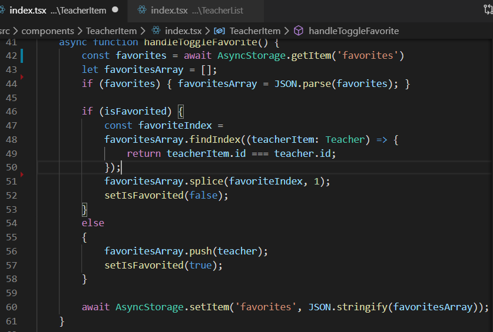
    <br>
</h1> 


O favoriteArray.push adiciona o item no Array de favorito, o splice remove o conteúdo da lista. No botão dos favoritos há apenas um condicional trocando a imagem do botão favorito:

 <h1 align="center">
    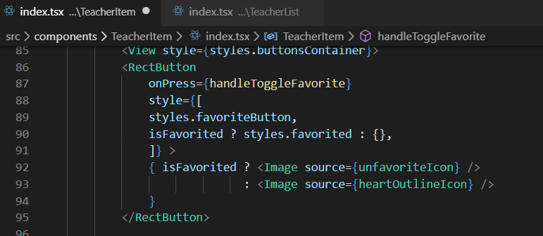
    <br>
</h1> 

Na página TeacherList precisamos de uma variável constante de estado, para acompanhar as mudança no controle salvando a id do professor.

```bash
const [favorites, setFavorites] = useState<number[]>([]);
```
 <h1 align="center">
    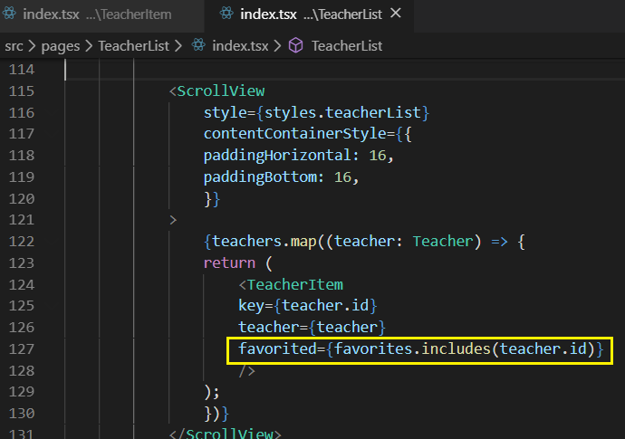
    <br>
</h1> 
 


    